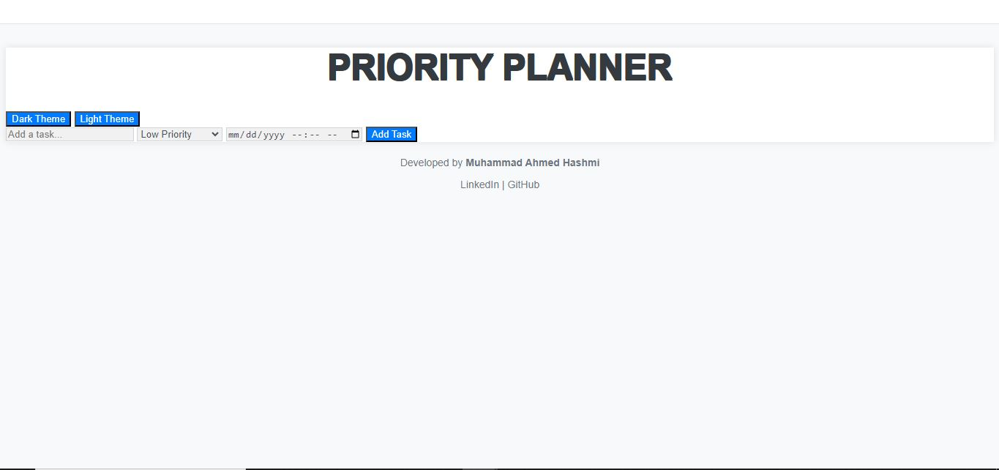
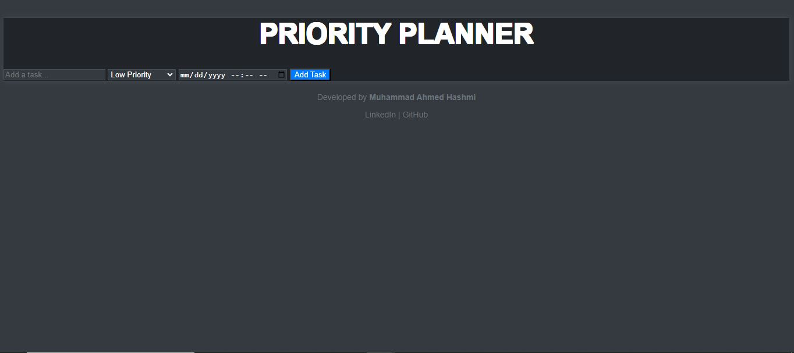
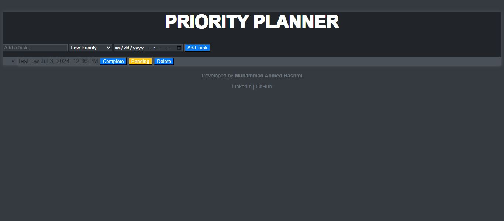
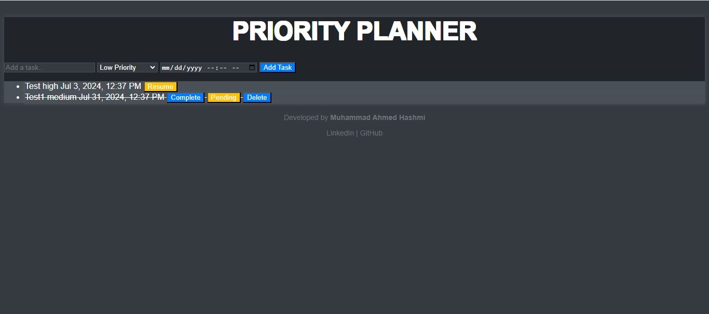

# Priority Planner

A simple To-Do List web application with priority and date functionalities.

### URL: https://priority-planner-13f70.web.app
 
## Features

- Add tasks with priority (Low, Medium, High) and due date/time.
- Mark tasks as complete or pending.
- Delete tasks from the list.
- Light and Dark theme options for user preference.

## Preview







## Installation

Clone the repository and open `index.html` in your web browser:

```bash
git clone https://github.com/mahmed-eng/Priority-Planner.git
cd priority-planner

